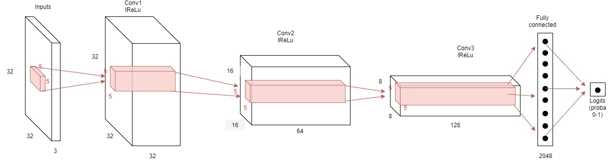
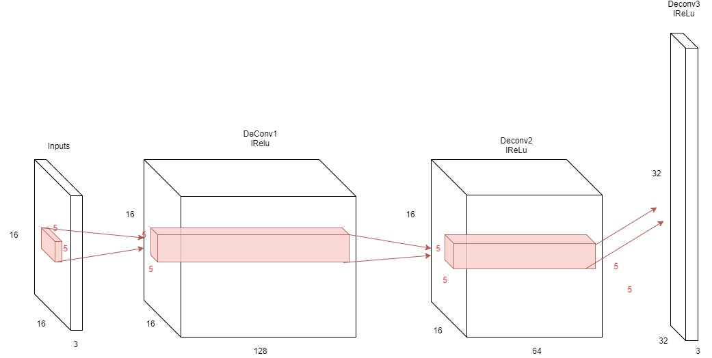
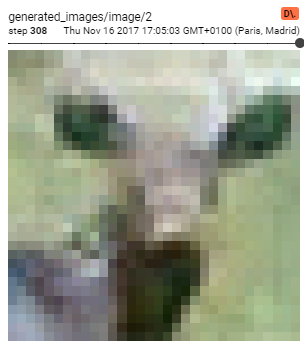
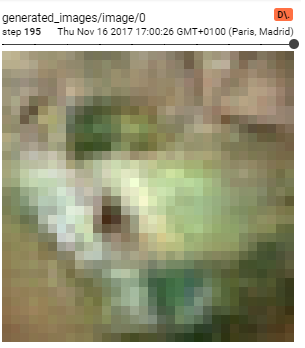

Tensorflow implementation of a Deep Convolutional Adversarial Network. It is used to resize Cifar-10 images from a 16x16 shape to the 
original 32x32.
This code is designed to run on any laptop with a tensorflow-gpu installation.

**__Model__**

The Gan consists of a Deep Convolutional Network trained at distinguishing Cifar original 32x32 images from the generated ones (the Discriminator),
and a Deep Deconvolutional Network tained fooling the discriminator: the Generator.

__Discriminator Model__

__Generator Model__

**__Results__**

We are aware that our model is too small to achieve any significant results. Truth is we lack the computing power for a larger one.
Nonetheless, we trained it on a 940mx Nvidia GPU.  
Here are some examples of generated images:

A Deer:  

A Car:  

